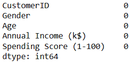
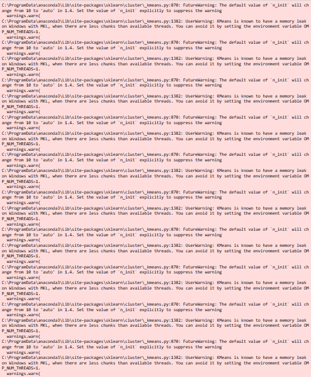
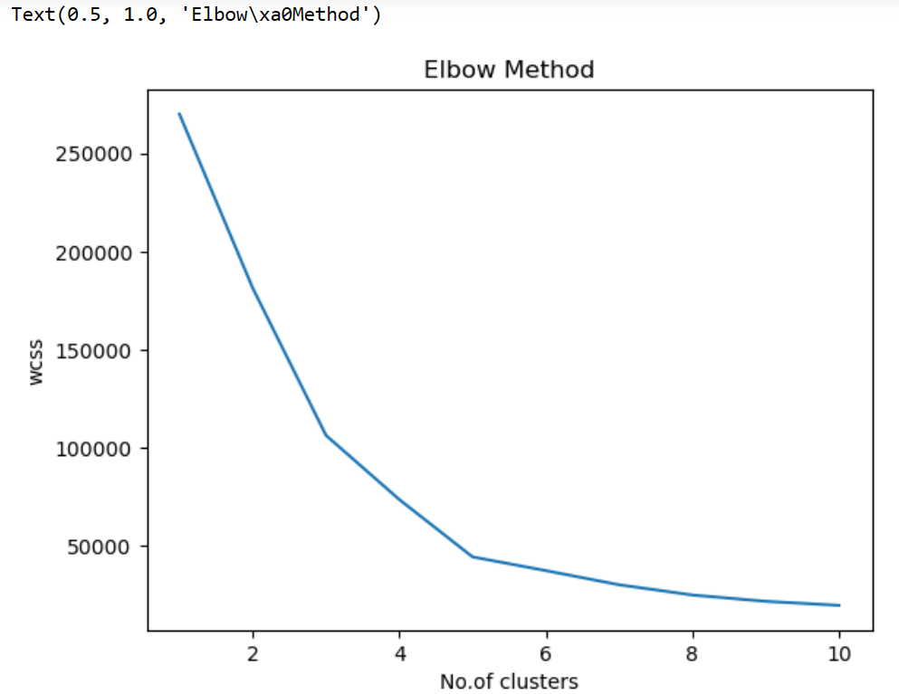
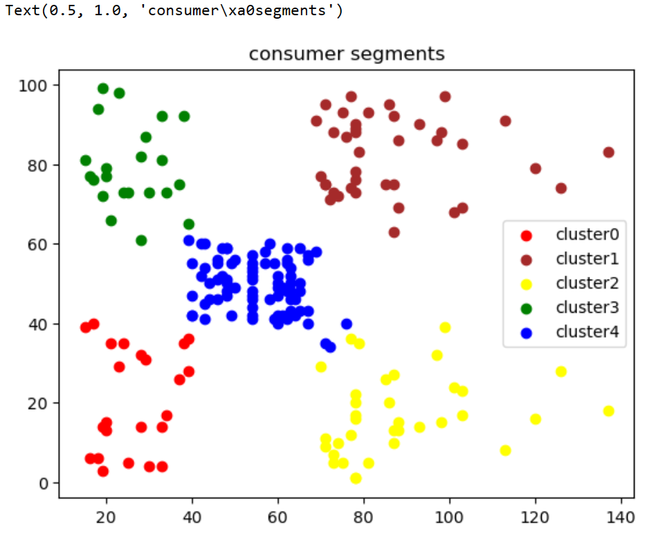

# Implementation-of-K-Means-Clustering-for-Customer-Segmentation

## AIM:
To write a program to implement the K Means Clustering for Customer Segmentation.

## Equipments Required:
1. Hardware – PCs
2. Anaconda – Python 3.7 Installation / Jupyter notebook

## Algorithm
1. Import the necessary packages using import statement.
2. Read the given csv file using read_csv() method and print the number of contents to be displayed using df.head().
3. Import KMeans and use for loop to cluster the data.
4. Predict the cluster and plot data graphs.
5. Print the outputs and end the program.

## Program:
```python

# Program to implement the K Means Clustering for Customer Segmentation.
# Developed by: Krithick Vivekananda
# RegisterNumber:  212223240075

import matplotlib.pyplot as plt
import pandas as pd
data=pd.read_csv('Mall_Customers.csv')
print(data)

data.head()

data.info()

data.isnull().sum()

from sklearn.cluster import KMeans
wcss=[]

for i in range(1,11):
    kmeans=KMeans(n_clusters=i,init="k-means++")
    kmeans.fit(data.iloc[:,3:])
    wcss.append(kmeans.inertia_)

plt.plot(range(1,11),wcss)
plt.xlabel("No.of clusters")
plt.ylabel("wcss")
plt.title("Elbow Method")

km=KMeans(n_clusters=5)
km.fit(data.iloc[:,3:])

y_pred=km.predict(data.iloc[:,3:])
print(y_pred)

data["cluster"]=y_pred
df0=data[data["cluster"]==0]
df1=data[data["cluster"]==1]
df2=data[data["cluster"]==2]
df3=data[data["cluster"]==3]
df4=data[data["cluster"]==4]
plt.scatter(df0["Annual Income (k$)"],df0["Spending Score (1-100)"],c="red",label="cluster0")
plt.scatter(df1["Annual Income (k$)"],df1["Spending Score (1-100)"],c="brown",label="cluster1")
plt.scatter(df2["Annual Income (k$)"],df2["Spending Score (1-100)"],c="yellow",label="cluster2")
plt.scatter(df3["Annual Income (k$)"],df3["Spending Score (1-100)"],c="green",label="cluster3")
plt.scatter(df4["Annual Income (k$)"],df4["Spending Score (1-100)"],c="blue",label="cluster4")
plt.legend()
plt.title("consumer segments")
```

## Output:
# DATASET


# data.head()

# data.info()

# CHECKING IF NULL VALUES ARE PRESENT

# FOR LOOP TO CLUSTER THE DATA


# ELBOW METHOD GRAPH

# FITTING OF DATA IN KMEANS


# PREDICTING THE VALUES


# KMEANS CLUSTERING GRAPH



## Result:
Thus the program to implement the K Means Clustering for Customer Segmentation is written and verified using python programming.
